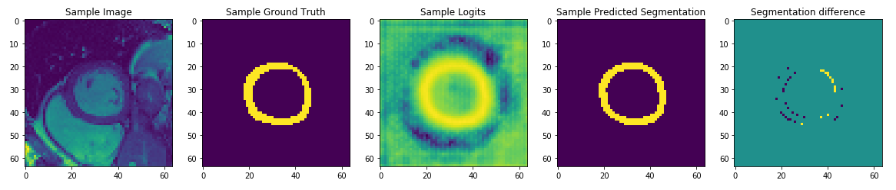
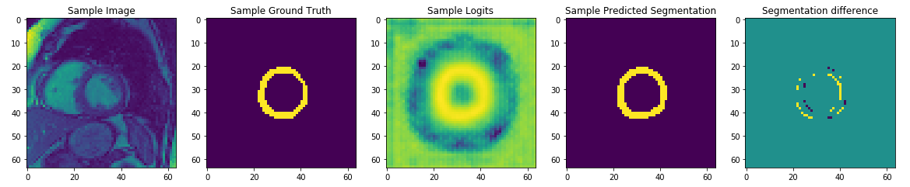

# Networks for Magnetic Resonance Artificial Intelligence Workshop (MRAI 2019)

This is work was performed as part of the MRAI workshop (MIDL 2019 satellite meeting) with exercises designed by Esther Puyol (https://github.com/estherpuyol/MRAI_workshop).

The original networks from the workshop were built using the pytorch library, as a learning exercise I have developed these networks using an alternative platform (TensorFlow).

### Google Collaboratory
The networks were built and tested using Google's Collaboratory platform. This is a cloud based Jupyter notebook environment where it is possible to utilise cloud GPU processing for network training. This makes it pracitcal to develop networks when no local GPU is available such as laptops. To get started with Collaboratory:

* Go to https://colab.research.google.com (be sure to be logged into your Google account beforehand)
* Click on the Github tab and enter https://github.com/laurencejackson/NeuralNets_MRAI into the search box
* A number of notebooks should appear, double click the one to load
* When the notebook loads we want to switch to using a GPU supported environment, so in the menu go to "Runtime" and then "Change runtime type".
* Choose GPU under hardware accelerator and then click Save.

# Networks

## LV_segmentation
#### Introduction
Quantitative analysis of cardiac MRI images typically requires a segmentation of the left ventricular (LV) myocardium from the surrounding tissues and  blood pool. This segmentation allows for calculations of useful clinical metrics such as LV ejection fraction, stroke fraction and myocardial mass. However, this segmentation process is often performed manually making it time consuming and susceptible to operator dependent variablility.

#### Objective
Train a neural network to automatically segment the left ventricle from 2D short axis cardiac MR images.

#### Method
A U-net style network was chosen for this problem since it allows for information about features at low and high resolutions to be jointly modelled, these networks have also been shown to work well with relatively low numbers of training samples. In this case we have a total of 420 samples where 10% of these are excluded from the training dataset and used for testing unseen samples.

#### Results
Figure 1 shows the predicted segmentations of the trained network on a sample from the training data. 

<em>Figure 1 - predictions from training sample.</em>

Figure 2 shows the predicted segmentations of the trained network on a sample from the test data. In this case the network is shown to provide useful segmentations from unseen data. 

<em>Figure 2 - results from unseen sample.</em>

